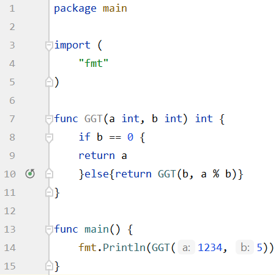

# TUTORIAL TO GO ;)

## WHAT'S GO?

“Go is an open source programming language that makes it easy to build simple, reliable, and efficient software.” – https://golang.org [1].​

## WHERE DOES GO COME FROM?

* Developed by google in 2007​

* Google needed a programming language:​
    * As fast as C​

    * As easy as Python​

    * Inheritance like in Java​

* Google servers were a mix of those three languages​

* Go is an offspring from C​

## WHY GO?​

* has a fast compiler ​

* huge standard library ​

* has many built-in tools (for testing, code coverage, etc.) ​

* supports many platforms: ​

    * Linux 2.6.23 or later ​

    * macOS 10.8 or later​

    * Windows XP SP2 or later ​

    * FreeBSD 9.3 or later ​
    
* Works on arm and x86 ​

* No interpreter is required for execution​

* Used by huge IT companies like:​

    * Google​

    * Twitter​

    * Uber​

    * And many more​
    
## HOW TO WRITE GO CODE​

* Official guidelines are:​

    * Keep all the code in a single workspace​

    * A workspace contains many version control repositories​

    * Each repository contains one or more packages​

    * A package has at least one Go source file per directory​

    * A package directory path determines its import path​

* Different from other programming languages since their projects usually have separate work spaces and those are closely tied to version control repositories​

## INTRODUCTION INTO CODING WITH GO​

Go programs are always made out of packages. Most of the packages are in the standard library. They´re basically code files that contain functions. With the import command you can import a package. In the example above, we import the "fmt" package which contains the Println function. 

## How to define Variables

If you define a variable outside of a function you need to declare it with *var*.
After that you name the variable. In our example we named the first variable *a*. The data type comes at the end of the declaration. In our example it's an integer. 
You can also define multiple variables of the same datatype and add the datatype at the end of the declaration. Look at the example in line 6. 

## How to define Variables PT.2

If you declare two variables in one declaration, you can also give them two values. You have to separate those by a comma like in line 5. 
Another possibility is to not declare the datatype. Go will assign a datatype automatically, based on the values, that were given to the variable. Check out line 6 of the example. 
If you define a variable within the function, you can just create a name and assign a value like in line 9. 

## For loop

The for loop is pretty similar to the for loop in c or c++. The only difference is, you can omit the (), but the {} are mandatory. 

## For loop PT.2

The initial statement and the post statement can be omitted like in line 7 in the example. 

## While loop

Some of you may have noticed it already in for loop PT.2. The for loop is also the while loop in go. You just write your while condition after the for statement. Make sure it terminates! 

## IF condition

The if statement is similar to if statements in C or C++, too. And once again the () are omitted but the {} are mandatory. 

## If condition pt.2

A cool thing you can do in go, is add a command within the if statement. It will be executed before the if condition is checked. Look at line 11 in the example. 

## Defer

Another cool feature is defer. Defer stalls function calls and puts them on the stack. The execution will be the very last one. If you defer more than one function the LIFO(last-in-first-out) principle will be used. Look at the output of our example and you will understand. 

## Switch case

The switch case function is pretty simple and similar to other programming languages. I decided to show it to you anyways because we will need it later for the Hands-On. 

## Arrays

The size of arrays can't be changed. You don't have to go with a for loop through the array to output it though. If you put the name of the array in the Println function, the entire array will be outputted. 

## Slices

While array have a fix size, slices are dynamic. The access of the elements in it is flexible. Coding with go, slices are used way more often than arrays. Slices are like references pointing on arrays. If you change an element in your slice, you change the array that's behind it. Check it out in this example. 

In the following example, the x is an array and the q is a slices. 
Do you see the difference? 

## Hands-On

In my Hands-On I'm coding the magic conch shell. 
What will we need for that?
* read the question from the command line (standard input)
* output of the answer(string) of the magic conch
* random answer generator (=random number generator)
* switch case function for the output options
* while loop to keep the magic conch answering our questions

So now that we know what we need, let's start coding!

First of all let's import some packages which we will need later. Let's declare a variable of the datatype string, too and name it question. Later we will safe the question into it and use it as our while loop condition. 

In the main function let's let the user know, that he is able to exit the program by typing "exit" as his question. We simply output that to the command line at the beginning of the program. As we know already, the while loop in go is a for loop with an exit condition. Our exit condition of the loop will be the users question. If the users input is "exit" we will exit the loop. 

In the next step, we need to make sure to safe the users input into the question variable so our exit condition is working. We will read the users command line input with the *scanner* function, which is contained in the *bufio* packages that we included in the beginning. We need to let the scanner function know, what it should scan. In our case it's the standard input from command line. Therefore we use another function called *Stdin* which is contained in the *os* package. We also need to let the scanner know, that it scans a text. And of course the user has to know, that he has to type his question now. 

After the users question, we want the magic conch shell to answer it of course.
So let's output *The magic conch says* to the command line. We don't want that in case the user types exit as his question to exit the program. So let's simple put an if condition in front of it. We also need to generate a random number, so the magic conch outputs every time a different answer. Therefor we use the *rand.Intn* function which is in the *math/rand* package included. Since we work in a deterministic environment the *rand.Intn* function will return every time the same random number. To prevent that we will use the *seed* function, which is also contained in the *math/rand* package. We need to seed the function with a different value every time the function is called. Using the time for that is perfect, since the time will be different every time the function is called. The time function we are using is also contained in a package. We included the *time* package in the beginning.

Now that we generated a random number. Let's use the switch case function, to output a different answer, based on the random number generated. Let's make 20 different answers. To make sure the random number generator, generates us only numbers from 0 to 19. To do that we need to write *20* into the *rand.Intn* function. I did that already above. Now let's generate answers.

Congratulations! We coded the magic conch shell together!

In my git, where you found this document, you can also find the entire code in one piece. 

Last but not least I wanna show you guys, how to write a recursive function with parameter passing. In my example I am writing a function which looks for the greatest common divisor. 

If you return a variable you need to let the function know about that. You have to declare the datatype of the variable that's returned right before the function body. *func GGT(a int, b int) **int** {* In our case we return one integer value, so there is one ***int*** in front of the function body. If you want to pass multiple parameters, you would need to write multiple data types in front of the function body.  

Thanks for reading guys. I hope you enjoyed it. 

